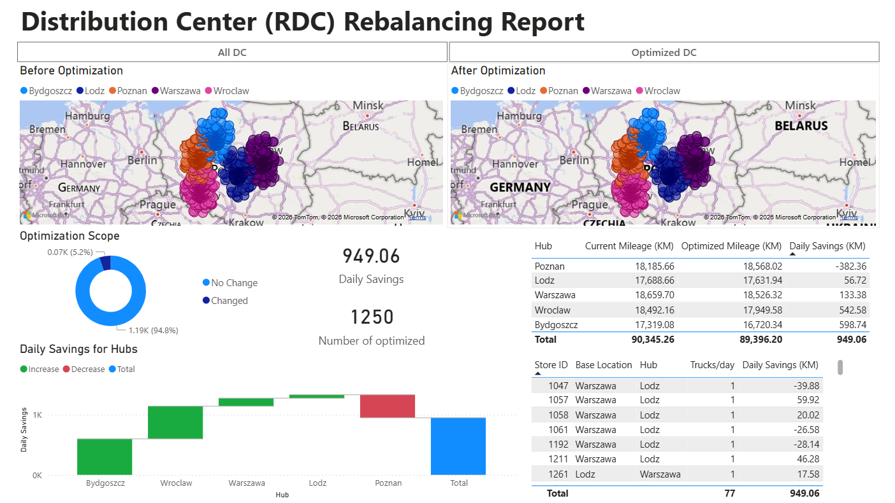
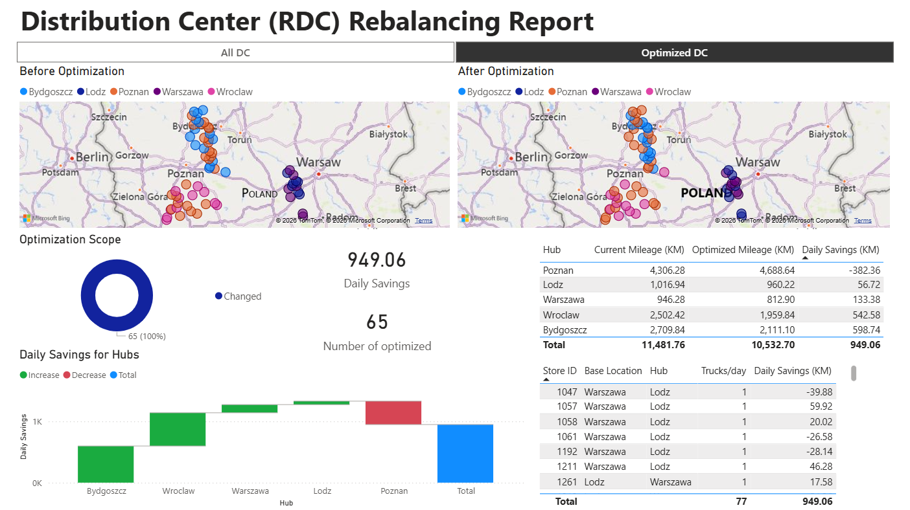

# Logistics-Network-Optimization: RDC Rebalancing

## Project Overview
This project is based on a real-world supply chain optimization challenge I solved during my **internship**. 

> **Note on Data Privacy:** Due to a Non-Disclosure Agreement (NDA), original business data cannot be shared. To demonstrate the algorithm's logic and efficiency, I have engineered a **synthetic dataset** that accurately mirrors the scale and complexity of the original logistics network.

The project addresses the challenge of optimizing the assignment of **1,250 retail points** to Regional Distribution Centers (RDC) across Poland. Using **SQL, Python, and Power BI**, I developed a solution to reduce transportation costs while maintaining strict operational balance.

## Business Impact
* **Efficiency:** Reduced total daily travel by **949 km**.
* **Cost Savings:** Significant reduction in fuel consumption and carbon footprint.
* **Automation:** Replaced manual reassignment processes with a scalable Python-based **Balanced Swap Algorithm**.

## Dashboard Preview
| Original Network  | Optimized Network |
| :---: | :---: |
|  |  |

## How the Algorithm Works
The **Balanced Swap Heuristic** identifies pairs of stores assigned to different hubs. If swapping their assignments reduces the total distance to their respective hubs, the swap is executed. This ensures that the total number of stores per hub remains constant, preventing operational bottlenecks.

## Tech Stack & Methodology
* **SQL:** Data extraction, cleaning, and geospatial distance matrix calculation.
* **Python (Pandas):** Developed a custom optimization heuristic to swap store assignments without overloading any single hub.
* **Power BI:** Built an executive-level dashboard for "Before vs. After" impact analysis.
